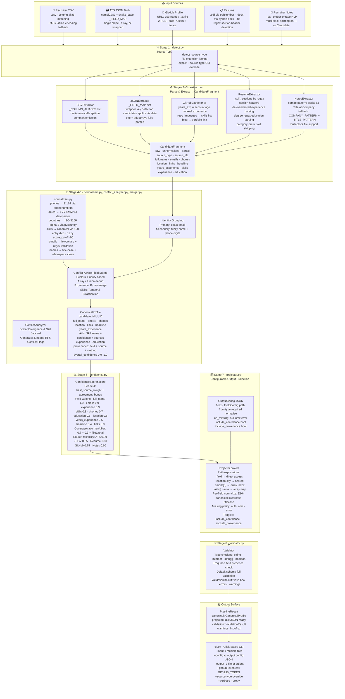
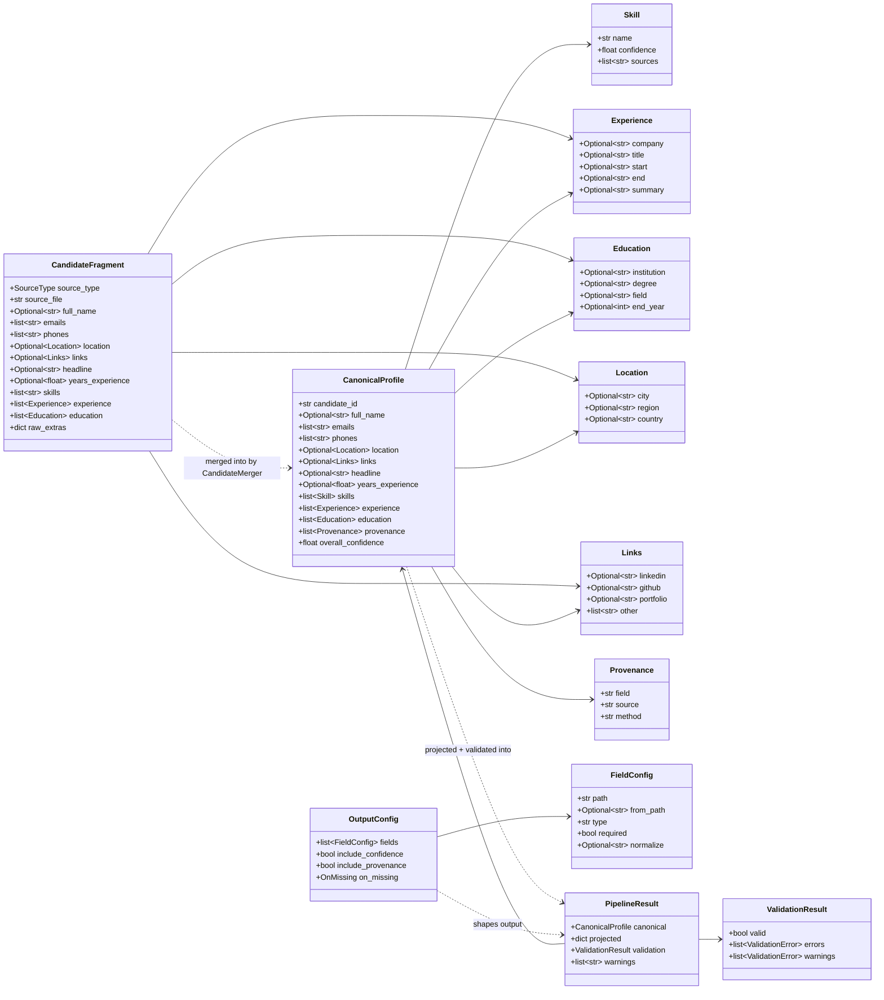
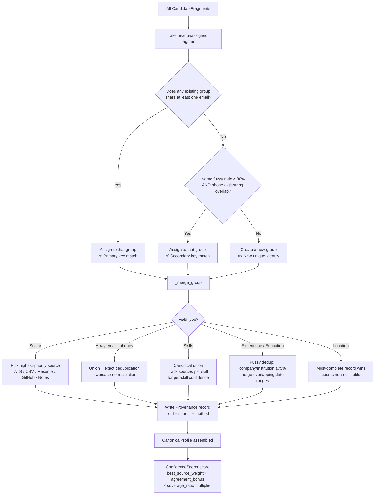
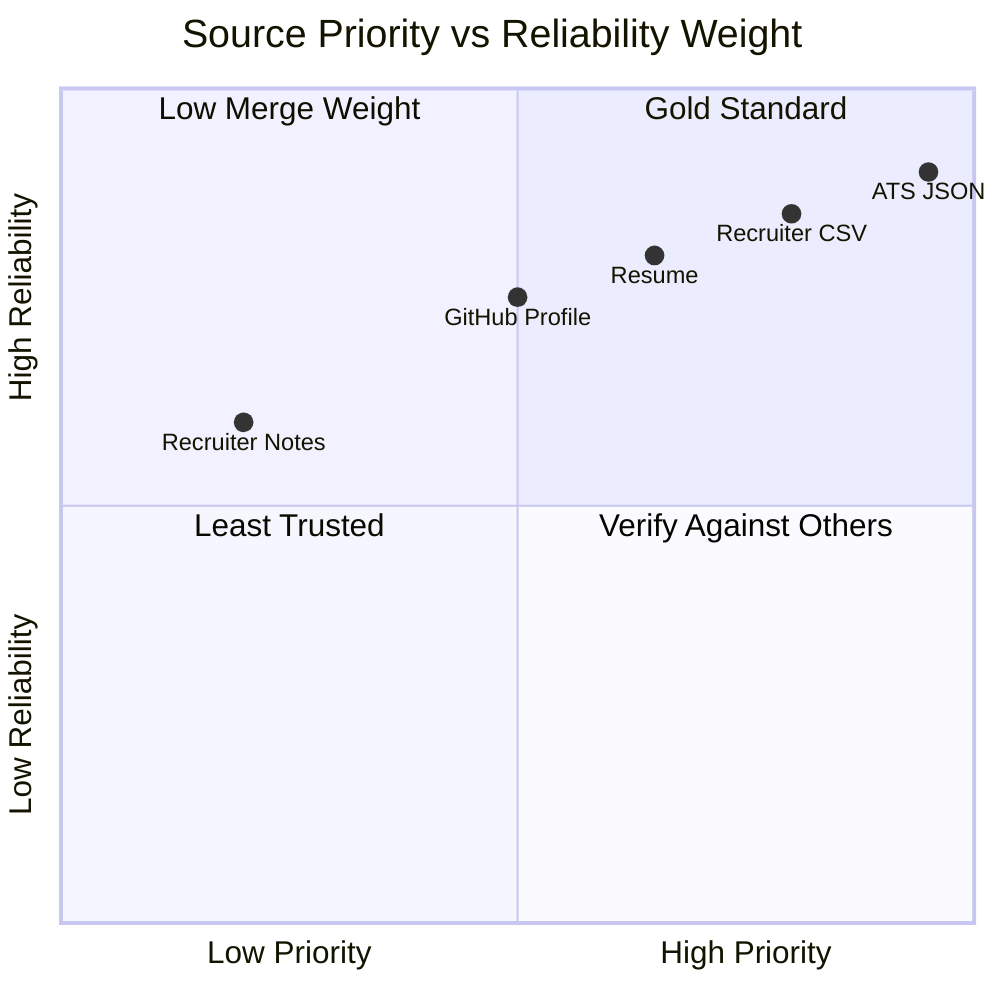

# Architecture Documentation

**Project:** Multi-Source Candidate Data Transformer  
**Author:** Rishit Sura  
**Last Updated:** 2026-06-30

---

## Overview

This document captures the complete system architecture of the candidate data transformer pipeline. The pipeline ingests candidate data from up to 5 different source types, merges them into a single canonical profile, and projects the output through a configurable runtime schema — all deterministically, without any LLM or ML inference.

### Design Philosophy

- **Deterministic**: Same inputs always produce the same output. No randomness, no LLMs.
- **Explainable**: Every field in the output is traceable back to a specific source and extraction method via `provenance` records.
- **Conflict-Aware**: Applies robust conflict analysis before merging to avoid silent conflict masking. Read more in the [Conflict Analysis & Lineage Architecture](./conflict_analysis.md).
- **Robust**: A missing, empty, or malformed source degrades gracefully — the pipeline never crashes due to a bad input.
- **Configurable**: A runtime JSON `OutputConfig` reshapes the output without any code changes.

---

## Table of Contents

1. [Full System Architecture](#1-full-system-architecture)
2. [Data Model Relationships](#2-data-model-relationships)
3. [Identity Matching & Merge Decision Tree](#3-identity-matching--merge-decision-tree)
4. [Source Priority & Reliability Weights](#4-source-priority--reliability-weights)

---

## 1. Full System Architecture

This diagram shows the end-to-end flow from raw input files through all 8 pipeline stages to the final JSON output.

**Key stages:**
- **Stages 1**: `detect.py` — classify each input file by source type
- **Stages 2–3**: `extractors/` — parse raw text/data into `CandidateFragment` objects
- **Stages 4–5**: `merger.py` + `normalizers.py` — group, normalize, and merge fragments into a `CanonicalProfile`
- **Stage 6**: `confidence.py` — assign a reliability score `[0.0, 1.0]` to each profile
- **Stage 7**: `projector.py` — reshape the canonical profile per the output `OutputConfig`
- **Stage 8**: `validator.py` — type-check the projected output and report errors/warnings

> ⚠️ **Known Issue** — The `GitHubExtractor` sets `years_experience` to the number of years since the GitHub account was created. This is not a proxy for real work experience and should be treated as metadata only.

---

## 2. Data Model Relationships

This class diagram shows the Pydantic data models used throughout the pipeline and how they relate to each other.

**Key model types:**
- `CandidateFragment` — raw, partial, unnormalized data from a single source
- `CanonicalProfile` — the fully merged and normalized internal representation
- `OutputConfig` / `FieldConfig` — runtime configuration that reshapes the output
- `PipelineResult` — the final wrapper returned by the pipeline

---

## 3. Identity Matching & Merge Decision Tree

This diagram shows the exact logic used by `merger.py` to decide whether two `CandidateFragment` objects belong to the same person, and how conflicts are resolved once they are grouped.

**Identity matching rules (in priority order):**
1. **Primary** — two fragments share at least one email address (exact, lowercased match)
2. **Secondary** — names are fuzzy-match ≥80% AND their phone digit-strings overlap (last 10 digits)

**Conflict resolution** applies after grouping, per field type:
- Scalar fields (`full_name`, `headline`, etc.) → highest-priority source wins
- Array fields (`emails`, `phones`) → union with exact deduplication
- Skills → canonical union, per-skill source list tracked for confidence
- Experience / Education → fuzzy dedup by company/institution name ≥75% + overlapping date ranges
- Location → most-complete record (most non-null fields) wins

---

## 4. Source Priority & Reliability Weights

This quadrant chart visualizes each source by its **merge priority** (x-axis: used for conflict resolution) and its **reliability weight** (y-axis: used in confidence scoring).

**Source reliability weights** (from `models.py`):

| Source | Priority Rank | Reliability Weight | Rationale |
|---|:---:|:---:|---|
| ATS JSON | 1 (highest) | 0.90 | Deliberately structured; highest data quality |
| Recruiter CSV | 2 | 0.85 | Structured export; slightly less authoritative |
| Resume | 3 | 0.80 | Candidate-authored; good coverage |
| GitHub Profile | 4 | 0.75 | Public signal; limited to public data |
| Recruiter Notes | 5 (lowest) | 0.60 | Free-text; most ambiguous to parse |

